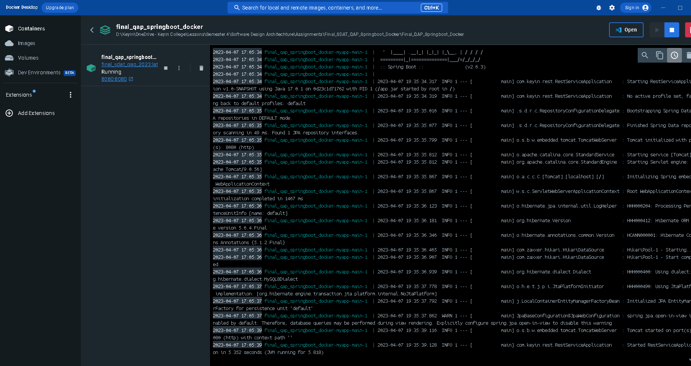
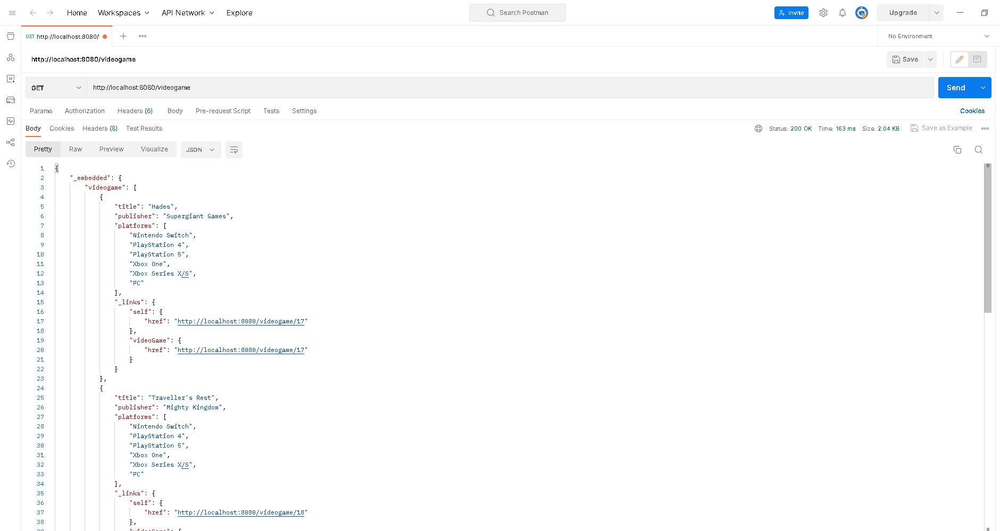
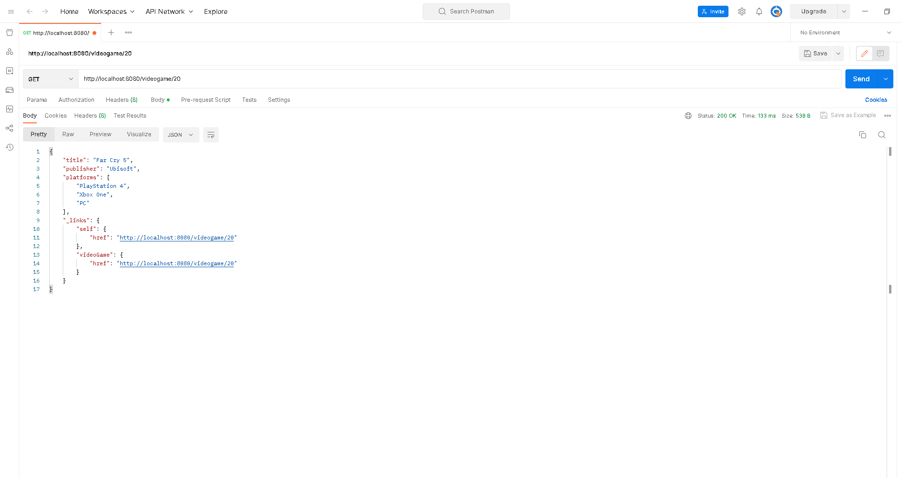
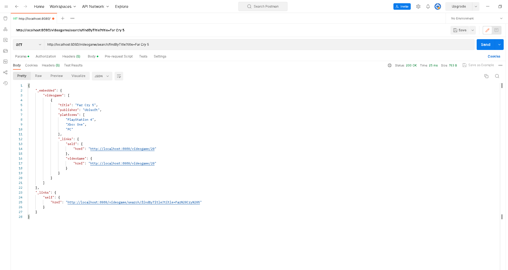
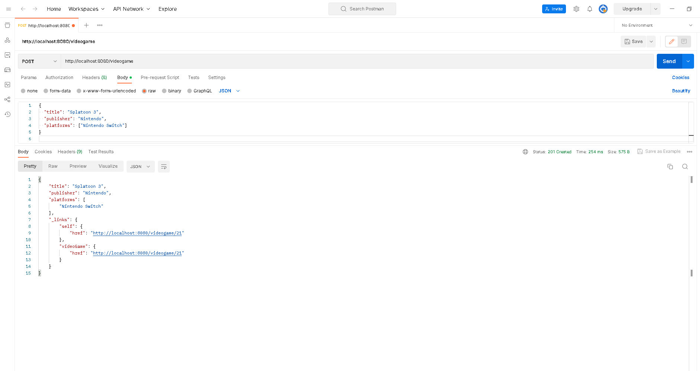
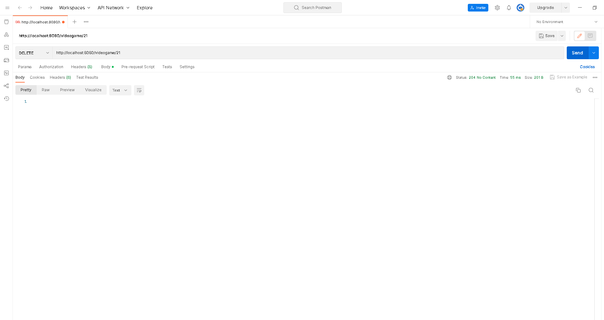

<h1>
  Semester 4 | Software Design Architechture | QAP 2
</h1>

Design and implementation of a RESTful API for a single resource, employing the RepositoryRestResource design pattern taught in class. Subsequently, the API is subjected to local testing within a Docker container environment.

  
<h3><strong>Assignment Instructions</strong></h3>

  <blockquote>
   
  For this QAP I’d like you to get hands on practice building a simple REST API for one simple 
  Resource following the RepositoryRestResource pattern we covered in our classes and then 
  testing it in a running Docker container locally.

  You can create a new API for any Resource you like.

  You should build out a new project from scratch, build up your pom file with the required 
  dependencies, add the required dockerfile and docker-compose files as well as your 
  RepositoryRestResource implementation.  

  Testing in postman is all that is required.

  Deliverables:
  -	GitHub Link to project
  -	Testing Screen Shots from postman and screen shots of the project running in docker.
  -	Details in the project readme about the new API and how to run project in docker.
  <blockquote>

  

  
<h3><strong>Screenshots</strong></h3>

   
  

____________________________________________________________________________________________________________________

### **Entity Information**

| Entity Name  | Fields                                                               | Sample JSON                                                                    |
| :----------: | :------------------------------------------------------------------- | :----------------------------------------------------------------------------- | 
| video_game   | title(*String*)   publisher(*String*)   platforms(*String[]*)|{ &emsp; "title": "Hades",  &emsp; "publisher": "Supergiant Games",  &emsp; "platforms": ["Nintendo Switch", "PlayStation 4", "PlayStation 5", "Xbox One", "Xbox Series X/S", "PC"]   }                                            |

<!--  
Unformatted Data:
-----------------

Entity Name:    Video_Games 	

Fields:         title(String)
                publisher(String)
                platforms(String[]) 	

Sample JSON:    {
                  "title": "Hades",
                  "publisher": "Supergiant Games",
                  "platforms": ["Nintendo Switch", "PlayStation 4", "PlayStation 5", "Xbox One", "Xbox Series X/S", "PC"]
                } 
-->

____________________________________________________________________________________________________________________

### **Endpoints**

|              Method                | URI                                              | Query Parameter          |
| :--------------------------------: | :----------------------------------------------- | :----------------------- |
| **GET** (All)                      | localhost:8080/videogame                         |                          |
| **GET** (By ID)                    | localhost:8080/videogame/{id}                    |                          |
| **GET** (Find by Title)            | localhost:8080/videogame/search/findByTitle      | ?title=\<*String*>       |
| **GET** (Find by Publisher)        | localhost:8080/videogame/search/findByPublisher  | ?publisher=\<*String*>   |
| **GET** (Find by Platforms)        | localhost:8080/videogame/search/findByPlatforms  | ?platforms=\<*String[]*> |
| **POST**                           | localhost:8080/videogame                         |                          |
| **PUT**                            | localhost:8080/videogame/{id}                    |                          |
| **PATCH**                          | localhost:8080/videogame/{id}                    |                          |
| **DELETE**                         | localhost:8080/videogame/{id}                    |                          |

